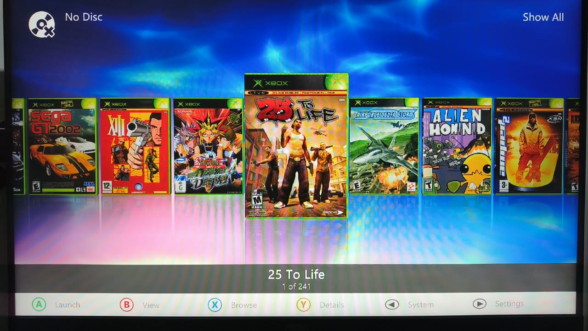
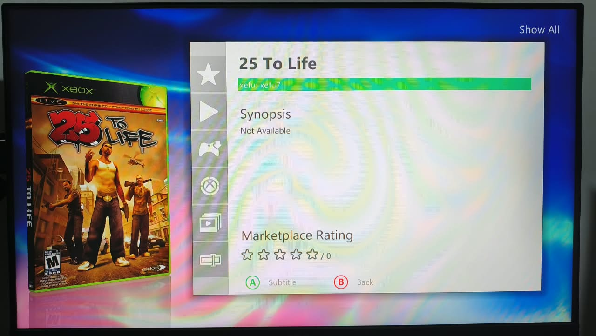
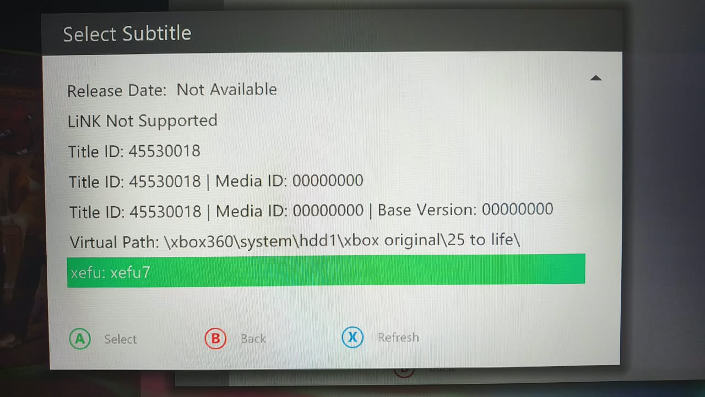
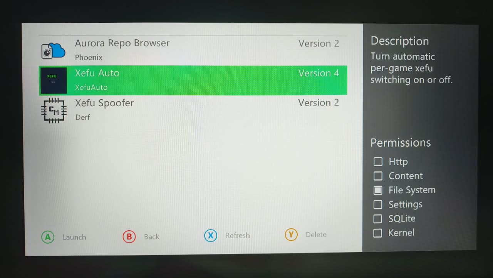
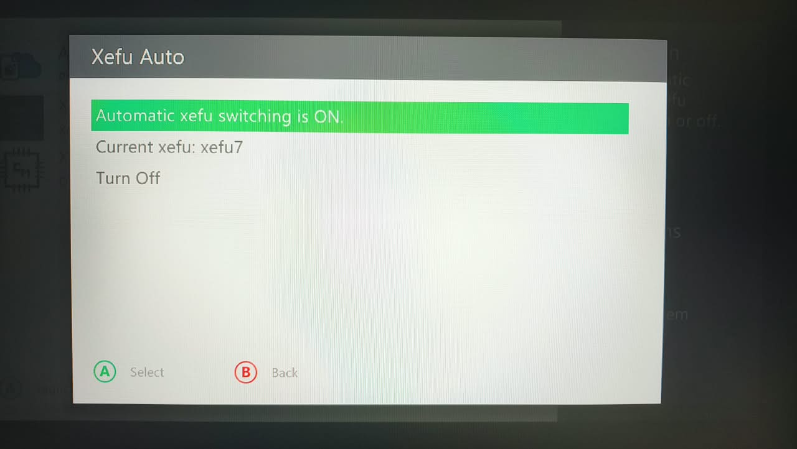

# Setting up XefuAuto

Step by step, with screenshots from a real console.

> 🇧🇷 Em português: [COMO-CONFIGURAR.md](docs/pt-br/COMO-CONFIGURAR.md)

---

## What this solves

The Xbox 360 runs Xbox Classic games through an emulator called **xefu**.
There are 12 versions of it, and **each game works best with a different
one**. Normally you'd swap them by hand, game by game.

XefuAuto does it for you: select a game in Aurora, and the correct xefu is
already in place. Press A and play.

---

## Part 1 — Install the files

You can install **over FTP** (easier) or **from a USB drive**. Pick one.

### Option A — Over FTP (recommended)

Your PC and console need to be on the same network.

1. Turn on the console and leave it **on the Aurora dashboard** (not in a
   game). Aurora's FTP only runs on the dash.
2. Find the console IP: **Settings → Network** in Aurora.
3. On your PC, double-click **`Install.bat`**.
4. Enter the IP when asked.

The installer sends everything and shows progress. It takes a few minutes
because of the xefu files (~7 MB).

To automate it (no prompts):

```
Install-XefuAuto.ps1 -Ip 192.168.0.10 -Quiet
```

If the original xefu files are already on the console, skip them and send
only the scripts (much faster):

```
Install-XefuAuto.ps1 -Ip 192.168.0.10 -SkipXefu
```

| Parameter | What it does |
|---|---|
| `-Ip` | Console IP address |
| `-User` / `-Password` | FTP login (default: `xboxftp` / `xboxftp`) |
| `-Quiet` | No prompts, no "press Enter" at the end |
| `-SkipXefu` | Send only the scripts, not the xefu files |

### Option B — From a USB drive

Use this if you have no network, or prefer copying manually.

1. Copy these folders from the package onto a USB drive.
2. Plug the drive into the console.
3. In Aurora, open the **File Manager**
   (Settings → Utilities → File Manager) and copy each item:

| From the USB drive | To the console |
|---|---|
| `Xefu\*.xex` (18 files) | `Hdd1:\Compatibility\XefuBackup\` |
| `Aurora\User\Scripts\Content\Subtitles\XefuAuto.lua` | `Game:\User\Scripts\Content\Subtitles\` |
| `Aurora\User\Scripts\Utility\XefuAuto\` (whole folder) | `Game:\User\Scripts\Utility\` |

> **Note:** if `Content\Subtitles` or `Utility` don't exist, create them
> first (File Manager has a "create folder" option).

> **About XefuBackup:** this folder holds the **original** xefu files.
> XefuAuto always copies *from* it and never modifies it. If you already
> have a XefuBackup with all 18 files, you can skip that copy.

### After installing (either way)

**Restart Aurora.** It only loads new scripts on startup.

---

## Part 2 — Activate it (one time only)

This is the only manual step, and it's one click.

### Before: games show "Last Played"

By default, Aurora shows **`Last Played:`** under each game name — the
date you last played it. That's the default info line:



### Step 1 — Open game details

In the list, pick any Xbox Classic game and press **Y** (Details).

You'll see the info line right under the game name. Press **A** (Subtitle)
to change which info is shown there:



### Step 2 — Pick "xefu:"

The **Select Subtitle** screen opens, listing everything Aurora can show
(Title ID, Media ID, Release Date, Last Played, Virtual Path...).

**Scroll to the bottom** and pick the **`xefu: ...`** line. Press **A**:



> Notice the line already reads `xefu: xefu7`. That's XefuAuto working: it
> read the game's Title ID (`45530018`) and worked out the best xefu for
> it. Each game shows its own.

**Done.** From here it's automatic — just browse your game list and the
xefu follows along.

---

## What about the "Last Played" info?

A common question, and the answer is reassuring.

Once you pick `xefu:`, **"Last Played" stops showing** under the game name
— the xefu shows instead. But that's only **which info is displayed**.

**Nothing was deleted.** The Last Played date is still stored, and Aurora
keeps recording when you play each game.

To see it again at any time, same path: **Y → A → Select Subtitle**, and
pick `Last Played`. The date will be there, untouched.

You can switch back and forth whenever you like. Just remember: while the
subtitle is **not** set to `xefu:`, XefuAuto doesn't run — that screen is
what makes it work.

---

## Turning it on and off

XefuAuto ships **enabled**. To disable (or re-enable), go to
**Back → Scripts → Xefu Auto**:



The panel shows the state and which xefu is loaded right now:



- **Automatic xefu switching is ON** — current state
- **Current xefu** — which xefu is on the console right now (read from the
  actual files, not from a saved record)
- **Turn Off / Turn On** — select this line and press **A** to toggle
- **B** goes back without changing anything

The panel speaks **English, Portuguese and Spanish**, following your
Aurora language automatically.

When disabled, the subtitle still shows which xefu *would* be correct,
with `(off)` at the end — but nothing is swapped.

---

## How to tell it's working

Browse your game list and watch the line under each name. It changes per
game:

```
25 To Life
xefu: xefu7

Ultimate Spider-Man
xefu: xefu5
```

To verify for real, open **Back → Scripts → Xefu Auto** and check
**Current xefu** — it reads the actual files in `Hdd1:\Compatibility\`.

---

## FAQ

**Do I need to reinstall when I add a new game?**
No. The table covers 961 games by Title ID. Any new game already in the
list just works.

**What if a game isn't in the table?**
The subtitle stays empty and nothing is swapped — the game runs with
whatever xefu is on the console. Nothing breaks.

**Does this touch my games?**
No. Only the emulator files in `Hdd1:\Compatibility\`, always copying
from `XefuBackup` (which stays untouched).

**A game froze. Now what?**
The table may list the wrong xefu for it. See [TABLE.md](TABLE.md) — you
can fix it yourself, it's a text file.

**How do I undo everything?**
Turn it off in **Back → Scripts → Xefu Auto**, then copy the files from
`Hdd1:\Compatibility\XefuBackup\` back to `Hdd1:\Compatibility\` using the
File Manager.

**Why does it copy the xefu to all 12 slots?**
The emulator decides on its own which slot to load. Filling all of them
means that whichever it picks, the game gets the right version. Same
technique the Xefu Spoofer uses.

---

## Requirements

- Xbox 360 with RGH/JTAG
- Aurora 0.7b or newer
- Xbox Classic games installed and scanned in Aurora
- For FTP install: FTP enabled in Aurora (default `xboxftp` / `xboxftp`)

---

## Credits

- Compatibility data: **ConsoleMods** community
- Official `TitleId → xefu` table: extracted by **Matheiulh** from update 5832
- Aurora / AuroraScripts: **XboxUnity**
